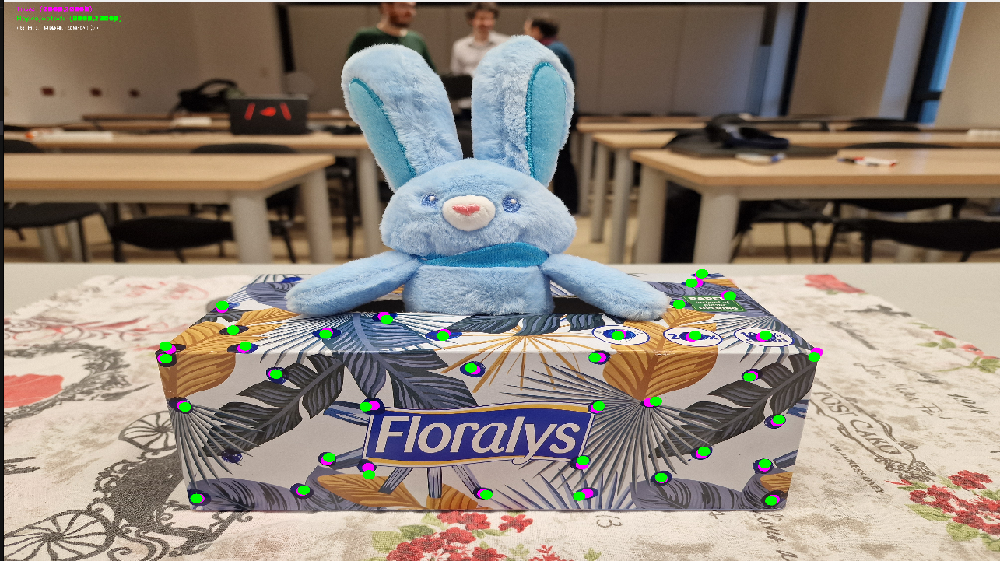
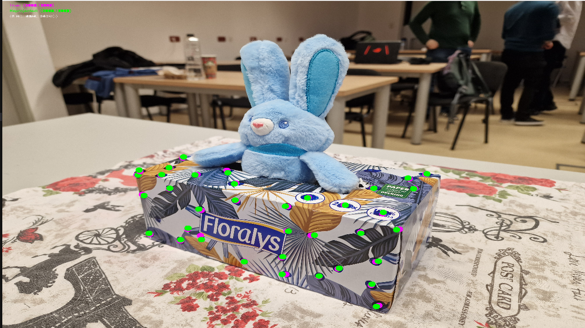
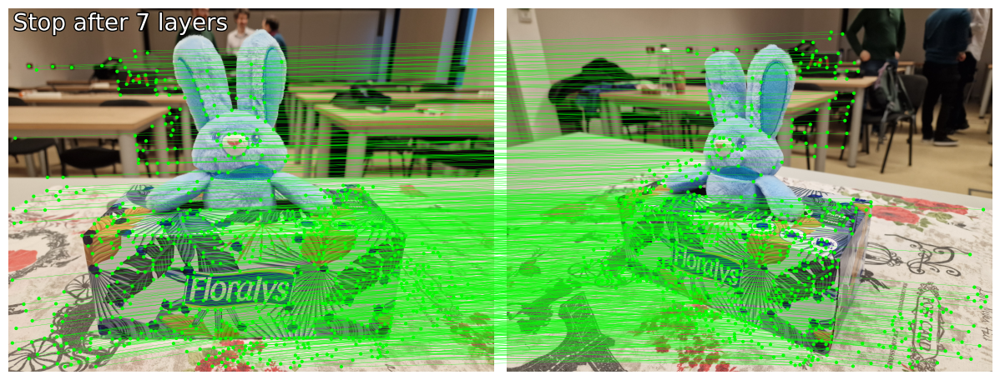
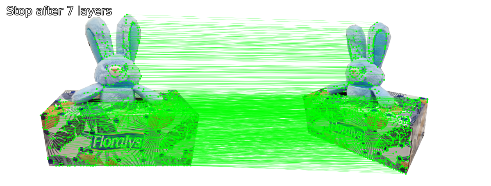
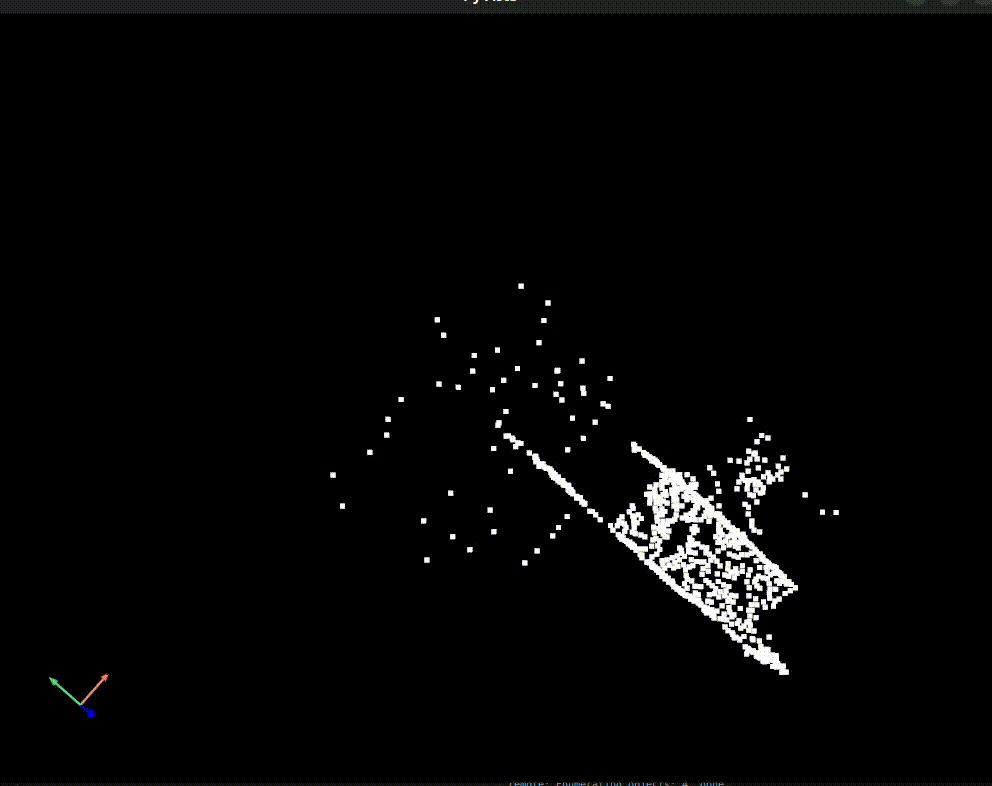
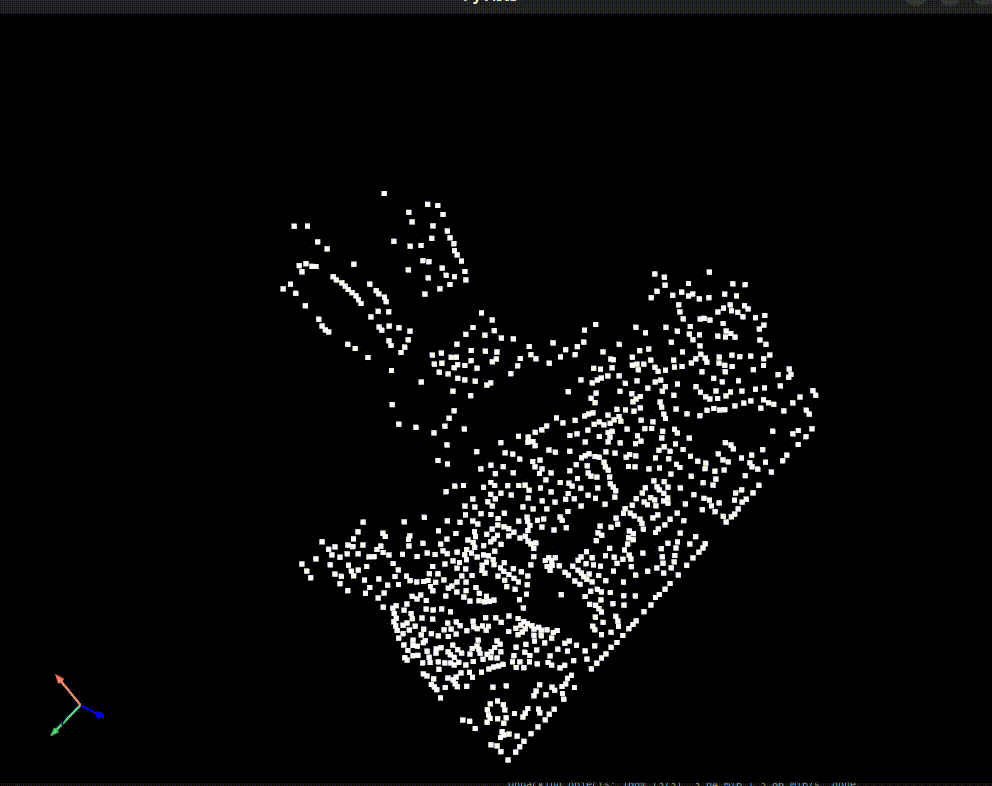
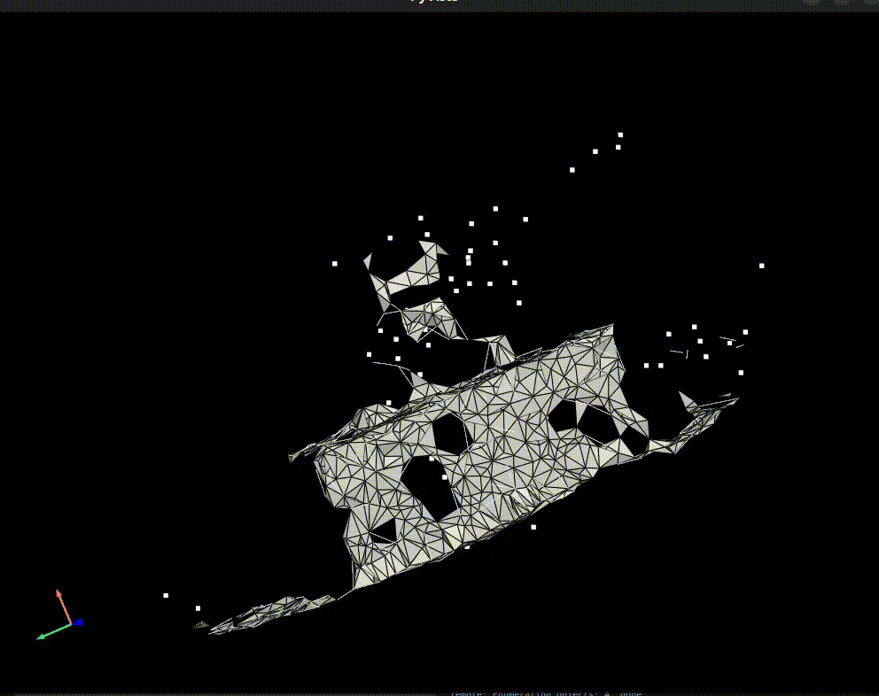
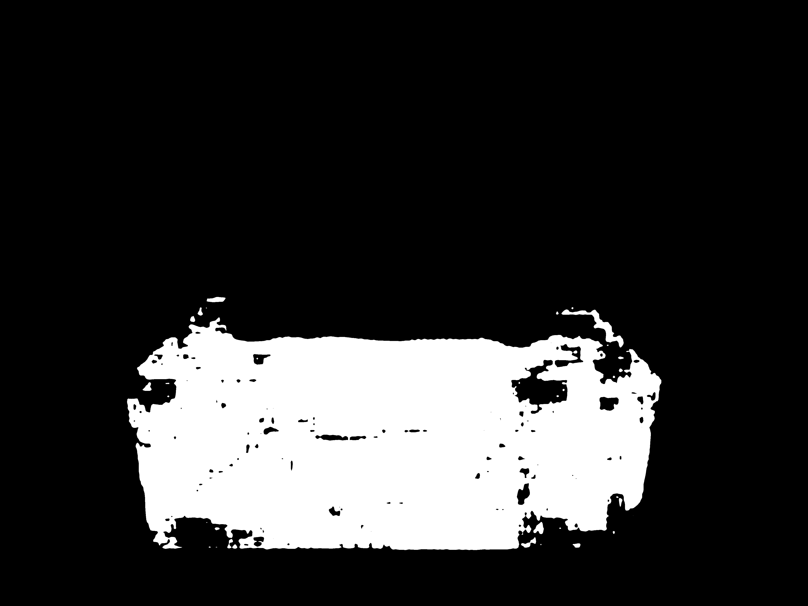
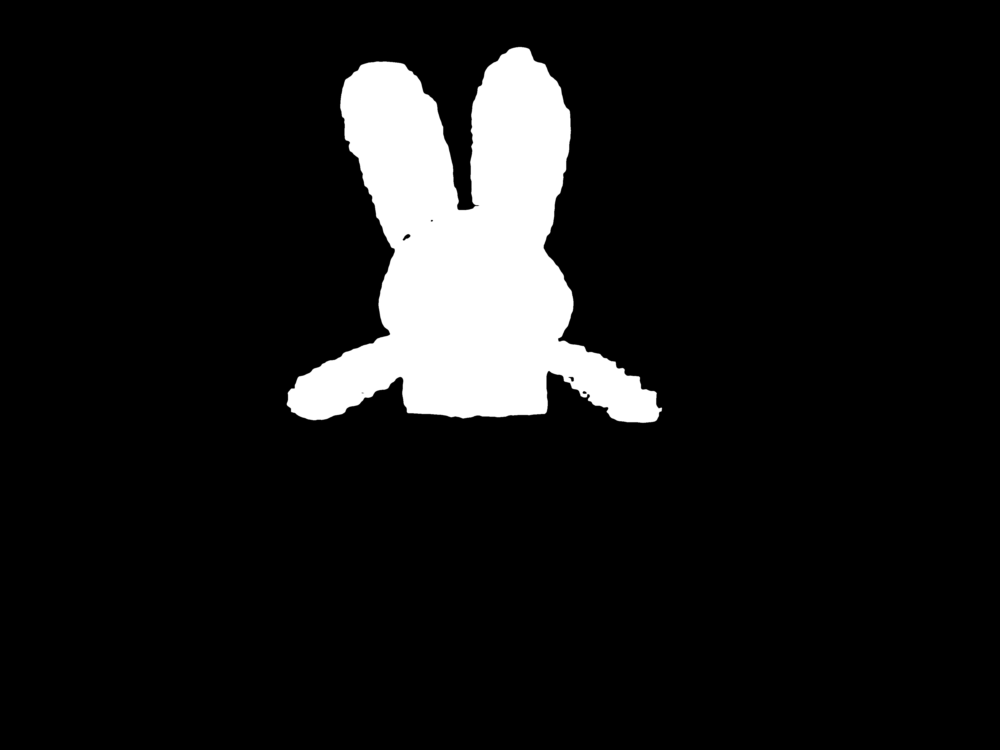

# Computer Vision - Homework 4
Students: [Nae Sebastian-Ion](naesebi2000@gmail.com)

Group: IA-1B

The collected data for this homework can be found at ```data``` and ```calibration_pictures```.

## 1. Finding the projection matrices

In order to find the projection matrices we have to solve the following equation:

$x = K[R|t] X$
Where:
- $x$ is the image coordonates in homogenous coordonates
- $K$ is the camera matrix
- $R$ is the rotation matrix
- $t$ is the translation vector
- $X$ is the world coordonates in homogenous coordonates

We can rewrite the equation as:
```math
[\lambda x_1, \lambda  x_2, \lambda] = \begin{bmatrix} f_x & 0 & c_x \\\ 0 & f_y & c_y \\\ 0 & 0 & 1 \end{bmatrix} \begin{bmatrix} r_{11} & r_{12} & r_{13} & t_1 \\\ r_{21} & r_{22} & r_{23} & t_2 \\\ r_{31} & r_{32} & r_{33} & t_3 \end{bmatrix} \begin{bmatrix} X_1 \\\ X_2 \\\ X_3 \\\ 1 \end{bmatrix}$
```
We can rewrite the equation as:

```math
\begin{bmatrix} \lambda x_1 \\\ \lambda x_2 \\\ \lambda \end{bmatrix} = \begin{bmatrix} f_x r_{11} + c_x r_{31} & f_x r_{12} + c_x r_{32} & f_x r_{13} + c_x r_{33} & f_x t_1 + c_x t_3 \\\ f_y r_{21} + c_y r_{31} & f_y r_{22} + c_y r_{32} & f_y r_{23} + c_y r_{33} & f_y t_2 + c_y t_3 \\\ r_{31} & r_{32} & r_{33} & t_3 \end{bmatrix} \begin{bmatrix} X_1 \\\ X_2 \\\ X_3 \\\ 1 \end{bmatrix}$
```

And to solve it by least squares we can rewrite it as follows:

$\lambda x_{i} = P X_i$

This can be rewritten as:
```math
$\lambda x_{i} = \begin{bmatrix} p_{i1} & p_{i2} & p_{i3} & p_{i4} \\\ p_{i5} & p_{i6} & p_{i7} & p_{i8} \\\ p_{i9} & p_{i10} & p_{i11} & p_{i12} \end{bmatrix} \begin{bmatrix} X_1 \\ X_2 \\\ X_3 \\\ 1 \end{bmatrix}$
```
$x_{i} * P X_i = 0$
```math
\begin{bmatrix} 0 && -X_i^T && y_iX_i^T \\\ X_i^T && 0 && -x_iX_i^T \\\ -y_iX_i^T && x_iX_i^T && 0 \end{bmatrix} \begin{bmatrix} P1 \\\ P2 \\\ P3 \end{bmatrix} = 0$
```
A simpler form of the equation is:

$A p = 0$

Where:
- $A$ is a matrix of size $2n \times 12$
- $p$ is a vector of size $12 \times 1$

The solution is done by minimizing the following equation:

$||Ap||^2$

This is done by firstly collecting data from the box and the mesured points on the sides of the box. The data was collected by drawing a dot and then mesuring the distance from the dot to the selected point as the world coordonates. 

To test the projection matrices we can project the points from the world coordonates to the image coordonates and then compare the results with the measured points. The results can be seen in the following image:




Script: ```calibration_script.py```

## 2. Finding corresponding points

The first attempt at doing this was by taking manually the points from the images. Due to the fact that this was not very accurate, the second attempt was to use a state of the art algorithm to find the keypoints and then match them. The algorithm used was [SuperPoint](https://arxiv.org/abs/1712.07629) with [LightGlue](https://arxiv.org/abs/2306.13643). The results of those can be seen in the following images:



Due to the fact that the results also had some points from the background that were matched, I have decided to remove the background from the images and then run the algorithm again. The results can be seen in the following image:



Script: ```neural_point_matching.py```

[LightGlue notebook](https://colab.research.google.com/github/cvg/LightGlue/blob/main/demo.ipynb)

Notebook: ```lightglue.ipynb```

## 3. Creating the point cloud

For creating the point cloud I have triangulated the points from the images and then used the projection matrices to project them in the world coordonates. The results can be seen in the following image:



For the second attempt without the background the results can be seen in the following image:



Script: ```point_cloud.py```

## 4. Creating a 3D mesh

For creating the 3D mesh I have used the point cloud and the triangulation from the previous step. The results can be seen in the following image:



For the second attempt without the background the results can be seen in the following image:


## 5. Texture mapping

For the texture mapping I continued using the point cloud and the triangulation from the previous step. For a simple texture mapping I just applied the texture from the image to the mesh. The results can be seen in the following image:


Without the texture to be repeated the results can be seen in the following image:


## Additional Results

In order to achive better results I have used the following techniques:
- Removing the background from the images
- Segmented the images to obtain
- Used DreamGaussian on the segmented images to obtain each object mesh
- Used the meshes to create the final mesh

Better point cloud from Point-E: https://openai.com/research/point-e 


The meshes can be seen in the following image:


DreamGaussian: https://dreamgaussian.github.io/

Segmentation: https://segment-anything.com/



Shap-E: https://arxiv.org/abs/2305.02463
The results can be seen in the following image:


Using multiple actors in the scene:
